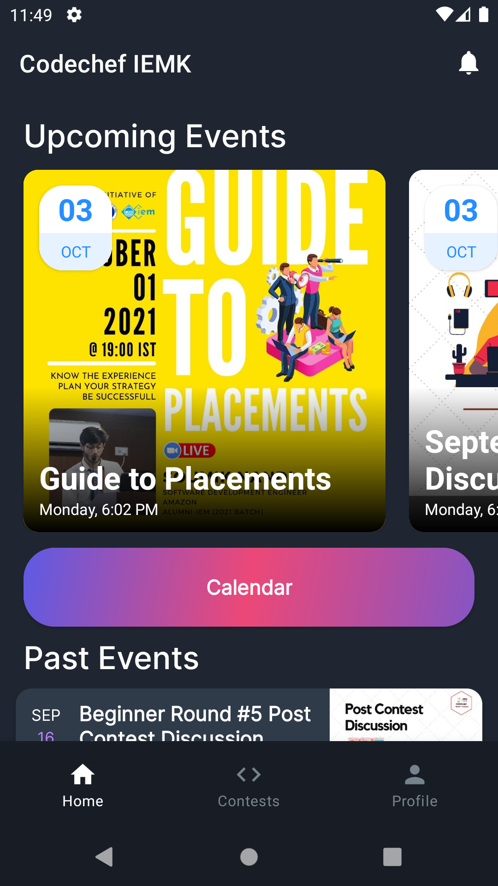
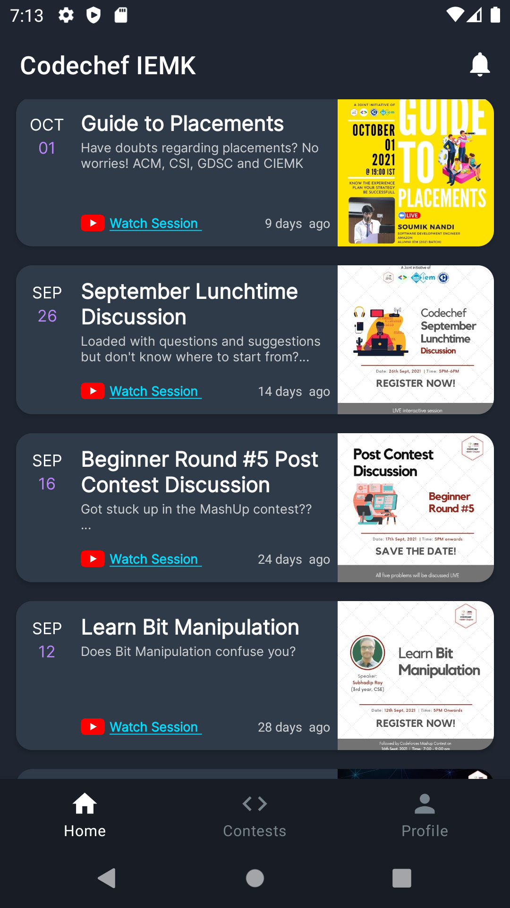
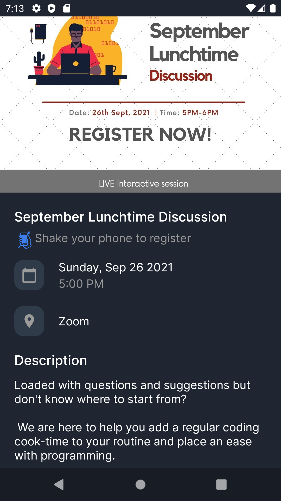
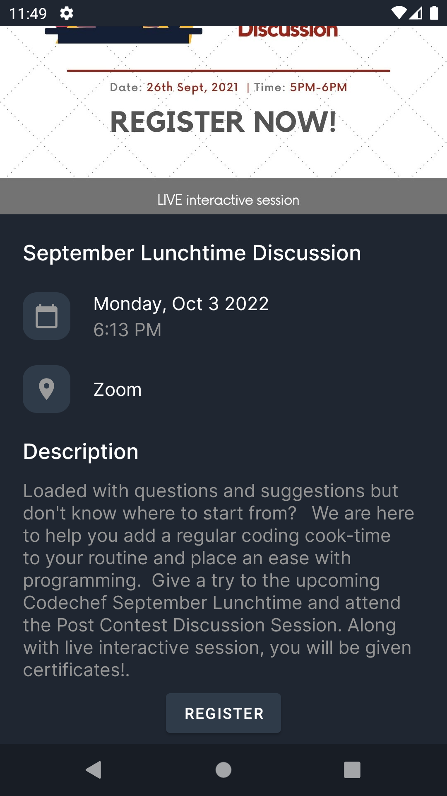
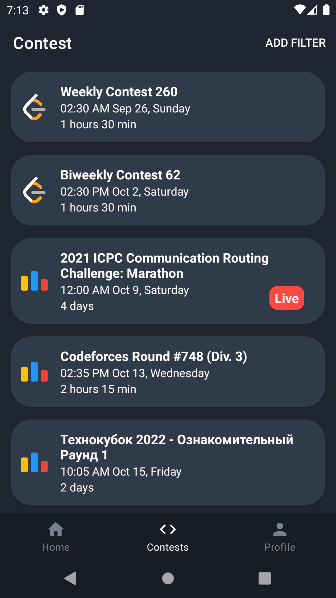
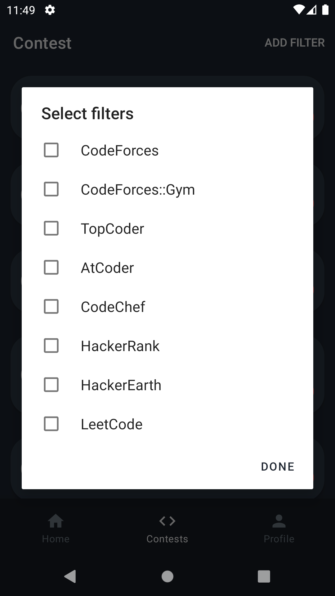
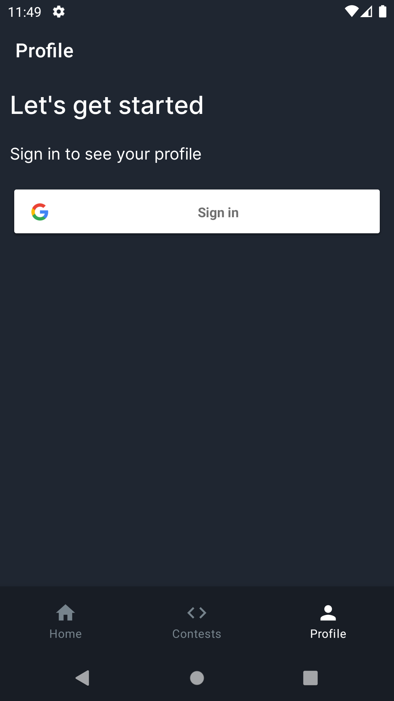
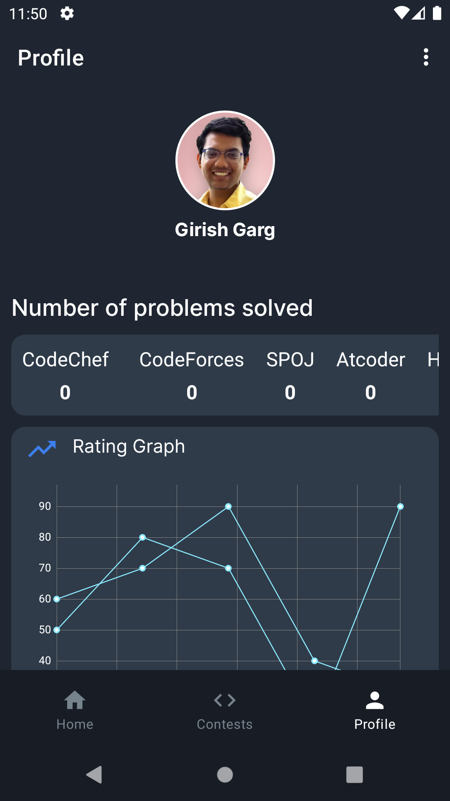
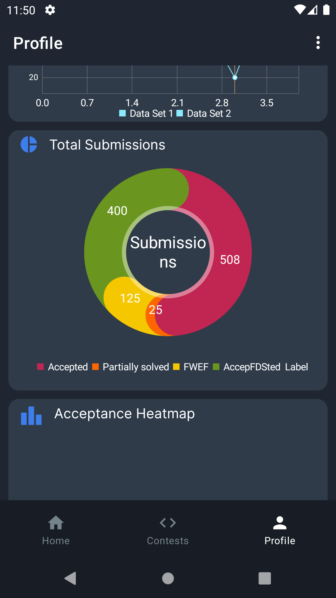
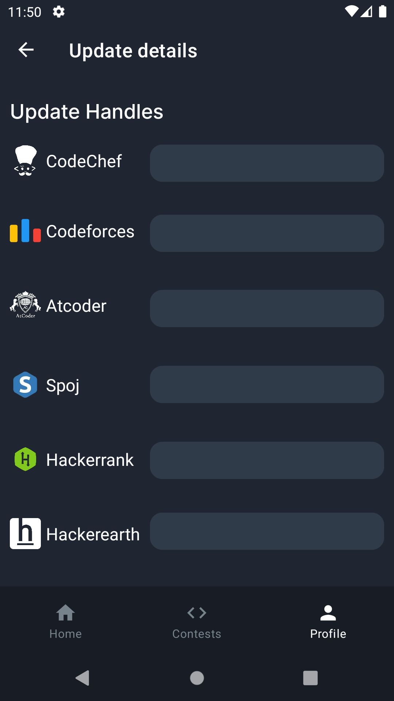

# CodechefEventsApp
<!-- ALL-CONTRIBUTORS-BADGE:START - Do not remove or modify this section -->

<!-- ALL-CONTRIBUTORS-BADGE:END -->
App to display events organised in college

# Screenshots

  
  
  

  

  
  
  
  
  
  

  

   
  

## Contributors ✨

Thanks goes to these wonderful people ([emoji key](https://allcontributors.org/docs/en/emoji-key)):

<!-- ALL-CONTRIBUTORS-LIST:START - Do not remove or modify this section -->
<!-- prettier-ignore-start -->
<!-- markdownlint-disable -->
<table>
  <tr>
    <td align="center"><a href="http:// gargVader.github.io"> <b>Girish Garg</b></a> <a href="https://github.com/gargVader/CodechefEventsApp/commits?author=gargVader" title="Code">💻</a></td>
    <td align="center"><a href="https://github.com/Suswan114"> <b>Suswan114</b></a> <a href="https://github.com/gargVader/CodechefEventsApp/commits?author=Suswan114" title="Code">💻</a></td>
    <td align="center"><a href="https://www.linkedin.com/in/srishti03/"> <b>Srishti Kumari</b></a> <a href="https://github.com/gargVader/CodechefEventsApp/commits?author=SrishtiC99" title="Code">💻</a></td>
    <td align="center"><a href="https://github.com/raghunath704"> <b>Raghunath Das</b></a> <a href="https://github.com/gargVader/CodechefEventsApp/commits?author=raghunath704" title="Code">💻</a></td>
    <td align="center"><a href="https://github.com/Nil2000"> <b>Anonymus2000</b></a> <a href="https://github.com/gargVader/CodechefEventsApp/commits?author=Nil2000" title="Code">💻</a></td>
    <td align="center"><a href="https://github.com/rudraneel18"> <b>RUDRANEEL DUTTA</b></a> <a href="https://github.com/gargVader/CodechefEventsApp/commits?author=rudraneel18" title="Code">💻</a></td>
  </tr>
</table>

<!-- markdownlint-restore -->
<!-- prettier-ignore-end -->

<!-- ALL-CONTRIBUTORS-LIST:END -->

This project follows the [all-contributors](https://github.com/all-contributors/all-contributors) specification. Contributions of any kind welcome!
